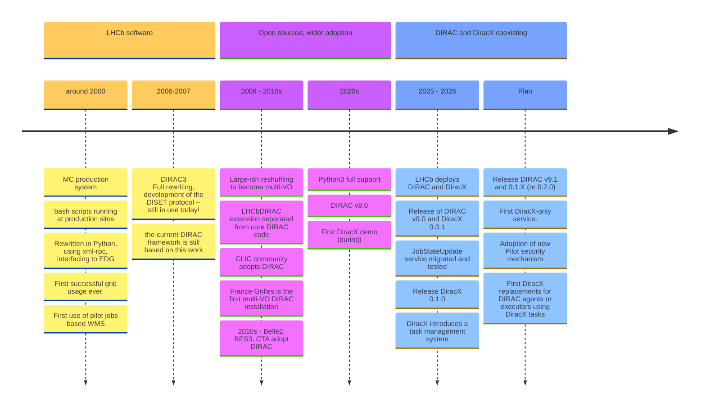

<!-- transition: slide-up -->

## Performance study and monitoring improvements for JUNO DCI system

**Xiao Han** <a href="mailto:hanx@ihep.ac.cn"><Email v="hanx@ihep.ac.cn" /></a>

January 21th 2026

<a href="https://indico.ihep.ac.cn/event/27193" class="ns-c-iconlink"><mdi-open-in-new />The 27th International Collaboration Meeting of the Jiangmen Underground Neutrino Observatory</a>

<a href="https://github.com/hanx-hep/27th-junocm-dci" class="ns-c-iconlink"><mdi-open-in-new />GitHub Repository</a>

---
layout: side-title
title: Table of Contents
color: rose-light
align: cm-lm
---

:: title ::

# Table of Contents

:: content ::

- *Status of JUNO Re-Production*  
- *Performance Bottleneck Discovery*  
- *Solutions and Improvements*  
- *New Monitoring Features*  
- *Summary*

---
layout: section
color: cyan-light
---

# Status of JUNO Re-Production

---
layout: top-title
color: gray-light
align: c
title: Summary of JUNO Re-Production
columns: is-8
---

:: title ::

# Summary of JUNO Re-Production

:: content ::

Three JUNO Re-Production campaigns were successfully completed.

* Oct 21, 2025 - Oct 23, 2025
* Nov 3, 2025 - Nov 5, 2025
* Jan 8, 2026 - Jan 10, 2026

<!-- 
 -->
<iframe src="https://dci-grafana.ihep.ac.cn/d-solo/ef1ogsnih5khsd/re-production?var-interval=3m&orgId=1&from=1759248000000&to=1768579199000&timezone=browser&var-origin_prometheus=&var-job=machinery&var-name=$__all&var-instance=cepcdci01.ihep.ac.cn&var-total=&var-device=$__all&var-maxmount=&var-show_name=cepcdci01.ihep.ac.cn&var-site=$__all&var-Filters=&var-JobSplitType=DataReconstruction-JUNO&var-src_url=juno-reprod&theme=light&panelId=218&__feature.dashboardSceneSolo" 
    style="
        width:200%; 
        height:40vh;
        transform: scale(0.5);
        transform-origin: 0 0;
        border:0;
    "></iframe>
<!-- 
 -->
<!-- 
 -->
<!--    -->
<!-- 
 -->

<!-- {width=10px} -->
<!--  -->

---
layout: top-title-two-cols
color: gray-light
align: c-l-l
title: Job Completion Status
columns: is-8
---

:: title ::

# Job Completion Status

:: left ::

#### Total Job Volume
* **1,639,753** jobs processed across all sites
    * **IHEP**: ~850,000 jobs (51.8%)
    * **IN2P3**: ~382,000 jobs (23.3%)
    * **JINR**: ~238,000 jobs (14.6%)
    * **CNAF**: ~169,000 jobs (10.3%)

#### Peak System Load
* **Maximum concurrent running jobs**: 22,484 (Oct 22, 2025)
* **Maximum queued waiting jobs**: 58,128 (Jan 9, 2026)

:: right ::

---
layout: top-title-two-cols
color: gray-light
align: c-l-l
title: Data Transfer Status
columns: is-8
---

:: title ::

# Data Transfer Status

:: left ::

#### Total Data Volume
* **7.53 PB** transferred across all channels

     IHEP contribution: Outbound: ~3.52 PB / Inbound: ~0.36 PB

#### Transfer Performance
* Average speed (all channels): **808 MB/s**

    IHEP performance:  Outbound: ~377 MB/s / Inbound: ~39 MB/s

#### System Efficiency
* **Overall transfer success rate**: 95.8%

<iframe src="https://dci-grafana.ihep.ac.cn/d-solo/aei92iii0cf7kc/fts3-transfer-monitoring?var-bin=10m&orgId=1&from=1760238089325&to=1768465260149&timezone=browser&var-site=$__all&var-vo=$__all&var-src_hostname=$__all&var-dst_hostname=$__all&var-protocol=$__all&var-transfer_type=$__all&var-work_type=%2F&var-constant1h=3600&var-constant10m=600&var-Filters=&theme=light&panelId=344&__feature.dashboardSceneSolo" 
    style="
        width:200%;
        height:24vh;
        transform: scale(0.5);
        transform-origin: 0 0;
        border:0;
    "></iframe>

:: right ::

---
layout: section
color: red-light
---

# Performance Bottleneck Discovery

---
layout: top-title-two-cols
color: gray-light
align: c-l-l
title: Summary of Performance Issues
---

:: title ::

# Summary of Performance Issues

:: left ::

* **Resource Sharing**: We borrowed substantial computing resources from other experiments (CPEC, BES, etc.) with sincere gratitude for their collaborative support

* **Unprecedented Scale**: The magnitude of resources and data volumes exceeded our initial projections

* **First Large-scale Stress Test**: The DCI system (Dirac+FTS+VOMS...) had never undergone stress testing at this scale before

* **Validation Opportunity**: The Re-production campaign provided an excellent opportunity to test and validate system performance under extreme conditions

* **Performance Bottlenecks**: Several critical performance bottlenecks were identified during the campaigns

:: right ::

* **Dirac Service Failures**: Services became unresponsive due to...
    1. High memory consumption
    2. Excessive thread usage
    3. Disk I/O bottlenecks

* **Transfer Failures**: File transfers failed during VOMS service outages
    
    (update host certificates) 

* **Network Issues**: Connectivity problems between IHEP and JINR sites

    (fixed by the multihop tunnel)

<!-- * **Resource Contention**: Competition for shared resources across experiments -->

<!-- * **Queue Management**: Job scheduling inefficiencies under peak loads -->

---
layout: top-title-two-cols
color: gray-light
align: c-l-l
title: Performance Screenshots and Analysis
columns: is-7
---

:: title ::

# High disk I/O for DIRAC main server

:: left ::

Machine metrics for all DCI servers are monitored.

### Disk I/O Bottleneck

- Disk I/O usage reaches 90% for prod-dirac.ihep.ac.cn
<!-- - Disk I/O bottlenecks during mass data transfers -->
- Read operations queued during high I/O periods
<!-- - Sandbox not responding -->

### Quick Fix

- Reduce log level
- Reduce MySQL output (data already stored in Elasticsearch)
- Reduce submission of short jobs (short jobs may cause brief MySQL write operations)

:: right ::

<iframe 
    src="https://dci-grafana.ihep.ac.cn/d-solo/begs7toz8usjkb/node-exporter-dashboard-details?var-instance=dirac.ihep.ac.cn&var-name=prod-dirac.ihep.ac.cn&var-show_name=prod-dirac.ihep.ac.cn&var-interval=3m&orgId=1&from=1762244754602&to=1762314051407&timezone=browser&var-origin_prometheus=&var-job=machinery&var-total=25&var-device=$__all&var-maxmount=%2Fopt&theme=light&panelId=175&__feature.dashboardSceneSolo"
    style="
        width: 200%;
        height: 30vh;
        transform: scale(0.5);
        transform-origin: 0 0;
        border: 0;
    "  
></iframe>

<iframe 
    src="https://dci-grafana.ihep.ac.cn/d-solo/begs7toz8usjkb/node-exporter-dashboard-details?var-instance=dirac.ihep.ac.cn&var-name=prod-dirac.ihep.ac.cn&var-show_name=prod-dirac.ihep.ac.cn&var-interval=3m&orgId=1&from=1762244754602&to=1762314051407&timezone=browser&var-origin_prometheus=&var-job=machinery&var-total=25&var-device=$__all&var-maxmount=%2Fopt&theme=light&panelId=160&__feature.dashboardSceneSolo"
    style="
        width: 200%;
        height: 30vh;
        transform: scale(0.5);
        transform-origin: 0 0;
        border: 0;
    "  
></iframe>

---
layout: top-title-two-cols
color: gray-light
align: c-l-l
title: Performance Screenshots and Analysis
columns: is-7
---

:: title ::

# Memory Peak for Sandbox Store Service

:: left ::

Memory usage of all DIRAC services are monitored

### Memory Overflow

Still investigating

but the DIRAC system is too complex, and the runit process management is outdated.

### Quick Fix

- A daemon process restarts services when services overload.
- Weekly restart of critical services

:: right ::

  <iframe
    src="https://dci-grafana.ihep.ac.cn/d-solo/9s0Ru8wVk/service-monitoring?var-bin=30m&orgId=1&from=1767977729000&to=1768030252000&timezone=browser&var-ServiceName=WorkloadManagement_SandboxStore&var-HostName=prod-dirac.ihep.ac.cn&theme=light&panelId=3&__feature.dashboardSceneSolo"
    style="
      width: 200%;
      height: 40vh;
      transform: scale(0.5);
      transform-origin: 0 0;
      border: 0;
    "
  ></iframe>

Service was restarted manually during the campaign to clear memory usage.

And Sandbox recovered after the restart.

---
layout: top-title
color: gray-light
align: c
title: Performance Screenshots and Analysis
---

:: title ::

# Threads limitation for Workload Management Service

:: content ::

### Thread for all DIRAC services is monitored

- Threads usage turns out to be high at beginning of re-production

    <iframe 
        src="https://dci-grafana.ihep.ac.cn/d-solo/9s0Ru8wVk/service-monitoring?var-bin=1h&orgId=1&from=1759258770921&to=1761310027646&timezone=browser&var-ServiceName=WorkloadManagement_JobStateUpdate&var-ServiceName=WorkloadManagement_JobStateUpdate-1&var-HostName=prod-dirac.ihep.ac.cn&theme=light&panelId=5&__feature.dashboardSceneSolo" 
        style="
            width: 200%;
            height: 40vh;
            transform: scale(0.5);
            transform-origin: 0 0;
            border: 0;
        "></iframe>

Thread count timeline chart

### Quick Fix

- Added a load-balanced Job State Update Service

---
layout: top-title
color: gray-light
align: c
title: Performance Screenshots and Analysis
columns: is-7
---

:: title ::

# Performance limitation for Dirac Services

:: content ::

<!-- - Logs for all DIRAC services are monitored -->

-  High load for Configuration Service / Sandbox Store

### Quick Fix

- Added a load-balanced Configuration Service

- Adjusted the scheduling policy to reduce the number of jobs that end at the same time

<!-- --- -->
<!-- layout: top-title-two-cols -->
<!-- color: gray-light -->
<!-- align: c-lm-lm -->
<!-- title: Service Response Time Analysis -->
<!-- --- -->
<!--  -->
<!-- :: title :: -->
<!--  -->
<!-- # Service Response Time Analysis -->
<!--  -->
<!-- :: left :: -->
<!--  -->
<!-- :: right :: -->
<!--  -->
<!-- ## Service Response Time Analysis -->
<!--  -->
<!-- *Analysis: Service degradation under peak loads reveals scalability limitations in current architecture.* -->
<!--  -->
<!-- ### Key Observations: -->
<!-- - API response times increase from 200ms to 2+ seconds -->
<!-- - Database query time grows linearly with concurrent users -->
<!-- - Service timeouts occur above 10,000 concurrent requests -->

---
layout: section
color: green-light
---

# Solutions and Improvements

---
layout: top-title-two-cols
color: gray-light
align: c-l-l
title: Implemented Solutions
columns: is-6
---

:: title ::

# Implemented Solutions

:: left ::

### Short-term Solutions

**Memory Optimization**
- A daemon restarts services when needed
- Weekly restart of critical services

**Service Enhancements**
- **Configuration** and **JobStateUpdate** added
- Upgraded Elasticsearch to new server
<!-- - Improved dashboard visibility for key metrics -->

**Process Improvements**
- Adjusted job scheduling parameters
- Enhanced logging for failure diagnosis

:: right ::

### Long-term Solutions

**Service Scaling**
- Horizontal scaling of Dirac services
- Database sharding and replication strategies

**Infrastructure Upgrades**
- Storage system performance improvements
- Network optimization between key sites

**Architecture Evolution**
- DiracX, **"the neXt Dirac incarnation"**
- Containerization of critical components

---
layout: section 
color: lime-light
---

    
    -->
    

---
layout: top-title
color: gray-light
align: c
title: history
---

:: title ::

# DIRAC timeline

:: content ::

---
layout: top-title
color: gray-light
align: c
title: System Evolution Plan
---

:: title ::
# DIRAC Upgrade & Migration Steps

:: content ::

# Key Technical Features

<ul class="text-base leading-7">
  <li>Containerized deployment to ensure standardized and portable runtime environments</li>
  <li><b>Kubernetes orchestration</b> to support automated operations and elastic scaling</li>
  <li><b>MySQL</b> + <b>OpenSearch</b> to improve log/metadata search efficiency</li>
  <li><b>S3 object storage</b> to optimize job sandbox management and data access performance</li>
  <li>A modern authentication system based on <b>OAuth2/OpenID</b> to enhance security</li>
</ul>

  Start
  Complete

  

    
Database Upgrade

    
Add VO fields, rename tables, etc.

  

  
→

  

    
Containerized Deployment

    
Host → Container

  

  
→

  

    
Dual-Stack Parallel Operation

    
DIRAC 9 + DiracX

  

  
→

  

    
Extension Module Adaptation

    
IHEPDIRAC migration

  

  
→

  

    
DiracX Only

    
Migration of key subsystems

  

---
layout: top-title
color: gray-light
align: c
title: Migration
---

:: title ::

### Migration to DiracX

:: content ::

Services of DIRAC v9 and DiracX will need to live together for some time

<Arrow x1="300" y1="170" x2="370" y2="170" />
<!-- <Line :x1=345 :y1=200 :x2=345 :y2=500 :width=1 /> -->

<Arrow x1="610" y1="170" x2="680" y2="170" />
<!-- <Line :x1=633 :y1=200 :x2=633 :y2=500 :width=1 /> -->

     </img>
     </img>
     </img>

<SpeechBubble position="r" color='cyan' shape="round"  v-drag="[100,350,40,60]">
1
</SpeechBubble>

<SpeechBubble position="r" color='cyan' shape="round"  v-drag="[370,350,40,60]">
2
</SpeechBubble>

<SpeechBubble position="r" color='cyan' shape="round"  v-drag="[660,350,40,60]">
3
</SpeechBubble>

<SpeechBubble position="t" color='amber' shape="round"  v-drag="[160,350,120,180]">
DIRAC and DiracX share the databases
</SpeechBubble>

<SpeechBubble position="t" color='amber' shape="round"  v-drag="[430,350,160,180]">
A legacy adaptor moves traffic from DIRAC to DiracX services
</SpeechBubble>

<SpeechBubble position="t" color='amber' shape="round"  v-drag="[720,350,120,140]">
DIRAC services can be removed
</SpeechBubble>

---
layout: section
color: purple-light
---

# New Monitoring System Features

---
layout: top-title-two-cols
color: gray-light
align: c-l-l
title: New Features in Past Six Months
columns: is-7
---

:: title ::

# New Monitoring System Features/Services

:: left ::

## Re-production Dashboard

A new monitoring dashboard provides an overview of key metrics for JUNO Reproduction.

- **Jobs Metrics**: 
    - Stat panel of Job status 
    - Pie charts of job completion/failure grouping by site and users
    - Timeline of running/waiting job grouping by site and users

- **Data Transfer Metrics**:
    - Data transfer throughput grouping by site
    - Efficiency of data transfer grouping by site and user

:: right ::

<iframe src="https://dci-grafana.ihep.ac.cn/d/ef1ogsnih5khsd/re-production?var-interval=3m&orgId=1&from=now-10d&to=now-5d&timezone=browser&var-origin_prometheus=&var-job=machinery&var-name=$__all&var-instance=cepcdci01.ihep.ac.cn&var-total=25&var-device=$__all&var-maxmount=%2Fdata&var-show_name=cepcdci01.ihep.ac.cn&var-site=$__all&var-Filters=&var-JobSplitType=DataReconstruction-JUNO&var-src_url=juno-reprod&kiosk" style="width: 400%; height: 160vh; transform: scale(0.25); transform-origin: 0 0; border: 0;"></iframe>

---
layout: top-title-two-cols
color: gray-light
align: c-l-l
title: New Features in Past Six Months
columns: is-7
---

:: title ::

# Certification and Validation

:: left ::

### Certificate Expiration Severely Affects Systems

- We use voms to generate proxies
- Proxies are cached in DIRAC and FTS
- If the host certificate expires, we need to remove this voms and manually clean up the cache

### Certificate Inspection Probes and Monitoring
- Certificate inspection probes
- Certificate validity checks
- An email alert will be sent when only two weeks remain.

:: right ::

<iframe src="https://dci-grafana.ihep.ac.cn/d-solo/df1vccbixeyo0a/admin-dashboard?var-interval=3m&orgId=1&from=1768554740486&to=1768641142486&timezone=browser&var-origin_prometheus=&var-job=machinery&var-name=$__all&var-instance=cepcdci01.ihep.ac.cn&var-total=25&var-device=$__all&var-maxmount=%2Fdata&var-show_name=cepcdci01.ihep.ac.cn&var-site=$__all&var-Filters=&var-Filters-2=&var-Filters-3=&refresh=30m&theme=light&panelId=294&__feature.dashboardSceneSolo" 
    style="
        width: 200%;
        height: 20vh;
        transform: scale(0.5);
        transform-origin: 0 0;
        border:0;"
    ></iframe>
    

 

    <iframe src="https://dci-grafana.ihep.ac.cn/d-solo/df1vccbixeyo0a/admin-dashboard?var-interval=3m&orgId=1&from=1768554740486&to=1768641142486&timezone=browser&var-origin_prometheus=&var-job=machinery&var-name=$__all&var-instance=cepcdci01.ihep.ac.cn&var-total=25&var-device=$__all&var-maxmount=%2Fdata&var-show_name=cepcdci01.ihep.ac.cn&var-site=$__all&var-Filters=&var-Filters-2=&var-Filters-3=&refresh=30m&theme=light&panelId=295&__feature.dashboardSceneSolo" 
    style="
        width: 200%;
        height: 20vh;
        transform: scale(0.5);
        transform-origin: 0 0;
        border:0;"
        ></iframe>
    

---
layout: top-title
color: gray-light
align: c
title: New Features in Past Six Months
columns: is-7
---

:: title ::

# Failures Transfer Jobs in FTS

:: content ::

- Pie/histogram charts of failed transfer grouping by channels and error categories
- Table of failed transfer information

  <!-- Left side 8 -->
  

    <iframe
      src="https://dci-grafana.ihep.ac.cn/d-solo/df1vccbixeyo0a/admin-dashboard?var-interval=3m&orgId=1&from=1768696421884&to=1768782823884&timezone=browser&var-origin_prometheus=&var-job=machinery&var-name=$__all&var-instance=cepcdci01.ihep.ac.cn&var-total=25&var-device=$__all&var-maxmount=%2Fdata&var-show_name=cepcdci01.ihep.ac.cn&var-site=$__all&var-Filters=&var-Filters-2=&var-Filters-3=&refresh=30m&panelId=292&__feature.dashboardSceneSolo"
      style="
        width: 200%;
        height: 200%;
        transform: scale(0.5);
        transform-origin: 0 0;
        border: 0;
      "
    ></iframe>
  

  <!-- Right side 2 -->
  

    <iframe
      src="https://dci-grafana.ihep.ac.cn/d-solo/df1vccbixeyo0a/admin-dashboard?var-interval=3m&orgId=1&from=1768696421884&to=1768782823884&timezone=browser&var-origin_prometheus=&var-job=machinery&var-name=$__all&var-instance=cepcdci01.ihep.ac.cn&var-total=25&var-device=$__all&var-maxmount=%2Fdata&var-show_name=cepcdci01.ihep.ac.cn&var-site=$__all&var-Filters=&var-Filters-2=&var-Filters-3=&refresh=30m&theme=light&panelId=289&__feature.dashboardSceneSolo"
      style="
        width: 200%;
        height: 200%;
        transform: scale(0.5);
        transform-origin: 0 0;
        border: 0;
      "
    ></iframe>
  

 

<iframe src="https://dci-grafana.ihep.ac.cn/d-solo/df1vccbixeyo0a/admin-dashboard?var-interval=3m&orgId=1&from=1768696421884&to=1768782823884&timezone=browser&var-origin_prometheus=&var-job=machinery&var-name=$__all&var-instance=cepcdci01.ihep.ac.cn&var-total=25&var-device=$__all&var-maxmount=%2Fdata&var-show_name=cepcdci01.ihep.ac.cn&var-site=$__all&var-Filters=&var-Filters-2=&var-Filters-3=&refresh=30m&theme=light&panelId=287&__feature.dashboardSceneSolo" 
    style="width: 200%; height: 30vh; transform: scale(0.5); transform-origin: 0 0; border:0;"></iframe>
    

---
layout: top-title
color: gray-light
align: c
title: SAM Test
---

:: title ::

# In progress: SAM Test upgrade

:: content ::

<iframe src="https://dci-grafana.ihep.ac.cn/d-solo/df1vccbixeyo0a/admin-dashboard?var-interval=3m&orgId=1&from=1766971692770&to=1767576492770&timezone=browser&var-origin_prometheus=&var-job=machinery&var-name=$__all&var-instance=cepcdci01.ihep.ac.cn&var-total=25&var-device=$__all&var-maxmount=%2Fdata&var-show_name=cepcdci01.ihep.ac.cn&var-site=$__all&var-Filters=&var-Filters-2=&var-Filters-3=&refresh=30m&theme=light&panelId=290&__feature.dashboardSceneSolo" 
        style="width: 200%; height: 200%; transform: scale(0.5); transform-origin: 0 0; border:0;"
    ></iframe>
    

### SAM Test for Grid Sites Requires Improvement
- SAM test is unstable
- Cannot function when sites are busy
- SAM test visualization is inaccurate — Grafana cannot easily calculate site availability

### We are refactoring the SAM Test base on Yifan's work
---
layout: section
color: orange-light
---

# Summary

---
layout: top-title
color: gray-light
align: c
title: Key Achievements and Outlook
---

:: title ::

# Summary

:: content ::

- Achievements
    - Successfully completed three large-scale Re-Production campaigns
    - Processed **1.64 million jobs** with **95.8% data transfer efficiency**
- Bottlenecks and Solutions
    - Identified and addressed critical performance bottlenecks
    - Fixed issues during Re-Production
    - Long-term solutions for the JUNO DCI system is upgraded to DiracX
- DCI Monitoring system
    - Added some new features / dashboards for our monitoring system
    - Still have a lot of work to do

---
layout: credits
color: navy
loop: true
speed: 0.8
title: credits/people
---

    

        <strong>People</strong>  
    

    

        <strong>Reporter</strong>
    

    

        Xiao Han        <i>IHEP, CC</i> 
    

    

         <strong>Current Developers</strong>
    

    

        Xiao Han        <i>IHEP, CC</i> 
        Xuantong Zhang  <i>IHEP, CC</i> 
        Xiaomei Zhang   <i>IHEP, PHY</i> 
    

    

        <strong>JUNO Data Center Team</strong>
    

    

        Giuseppe Andronico                      <i>INFN, CNAF</i> 
        Andrea   Rendina                        <i>INFN, CNAF</i> 
        Nikita   Balashov                       <i>JINR, MLIT</i> 
        Andrei   Tsaregorodtsev                 <i>CNRS/IN2P3, CPPM</i> 
        Rachid   Lemrani                        <i>IN2P3, CC-IN2P3</i> 
        João Pedro Athayde Marcondes de André   <i>IN2P3, IPHC</i> 
    

&nbsp;
&nbsp;
&nbsp;
&nbsp;
&nbsp;
&nbsp;

    <strong>Questions?</strong>

    Thank you!

<!--
This is not a fully exhastive list (of developers)
-->

---
layout: section
color: cyan-light
align: r
---

## Backup

---
layout: top-title
color: gray-light
align: c
title: FAQ
---

:: title :: 

Q/A

:: content ::

- What did you use to make these slides?

--> [slidev](https://sli.dev/) with [neversink theme](https://gureckis.github.io/slidev-theme-neversink). Diagrams with [mermaid](https://mermaid.js.org)

